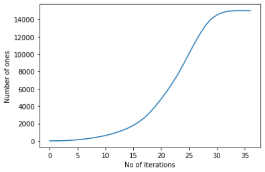
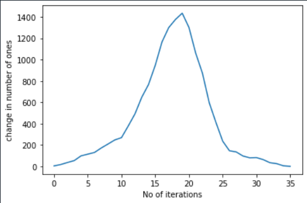

# Moodify-Learning
Assignments for Moodify project
This is the code for the first assignment for Moodify project
I have used 2D arrays for storing the numbers
I have created different functions like first_neighbour, second_neighbour , modify and swap
Swap implements the swap feature while the other three are used for the probability feature for the first and second neighbour
Here are the plots I got as the output

